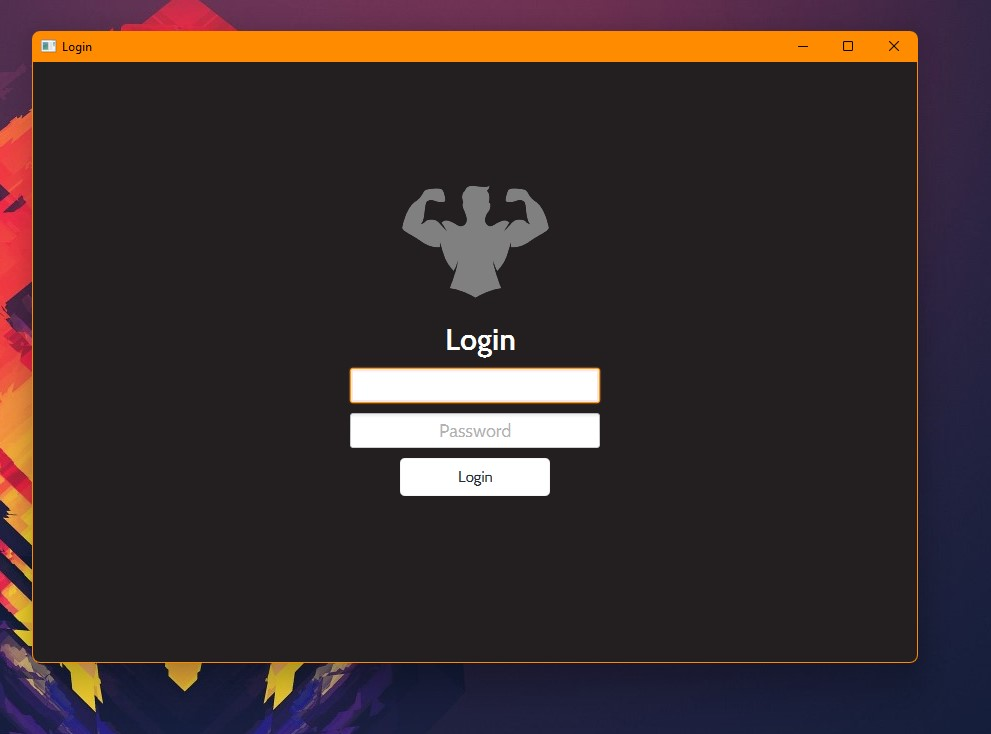

# FXGym
> A Javafx Gym Management Application built Using Javafx and Oracle Database 11g Express Edition

&nbsp;
&nbsp;

# Preview



&nbsp;
&nbsp;

# Classes

1. Gym
   - People
     - Employee
       - Manager
       - Coach
       - Engineer
       - Barista
       - Receptionist
     - Customer
   - Machine
2. dbConn

&nbsp;
&nbsp;

# Usage
1. First you need to add the [ojdbc6.jar](ojdbc6.jar) Library to the Project, and use [JDK 1.8.0_311](https://www.oracle.com/java/technologies/javase/javase8-archive-downloads.html)
&nbsp;
2. in the [dbConn.java](src\gym\system\dbConn.java) file change the dbname and dbpass Strings
&nbsp;


3. Create `Accounts` Table in the Database with ``` ID ``` and ``` password ``` Columns

&nbsp;

4. Create `Employees` Table in the Database with ``` ID ``` , ``` FIRSTNAME ``` , ``` LASTNAME ``` , ``` ROLE ``` , ``` WORKINGHRS ``` , ``` WORKINGDAYS ``` , ``` RATE ``` , ``` DISCOUNTF ``` , ``` DISCOUNT ``` , ``` ADDRESS ``` , ``` PRIVATE ``` , ``` TYPE ``` , ``` EXPERIENCE ``` , ``` AMOUNTOFFIXES ``` , ``` CHECKK ``` and ``` AGE ``` Columns


&nbsp;

4. Create `Customers` Table in the Database with ``` ID ``` , ``` FIRSTNAME ``` , ``` LASTNAME ``` , ``` AGE ``` , ``` NATIONALID ``` , ``` PHONENUM ``` , ``` INVITATIONS ``` , ``` SUBSCRIPTION ``` , ``` FREEDRINKS ``` and ``` VIPLOUNGEENTRY ``` Columns


&nbsp;
&nbsp;

# Done!
> now you can start up the program and use it :)